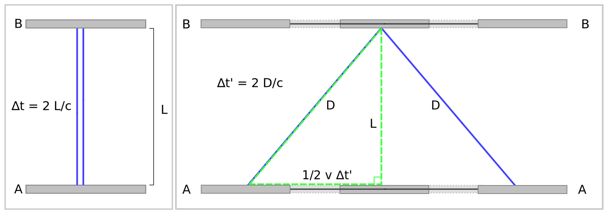
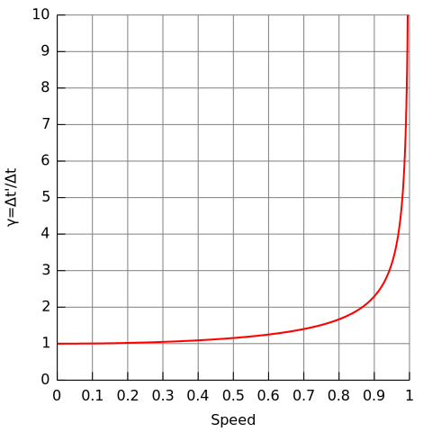
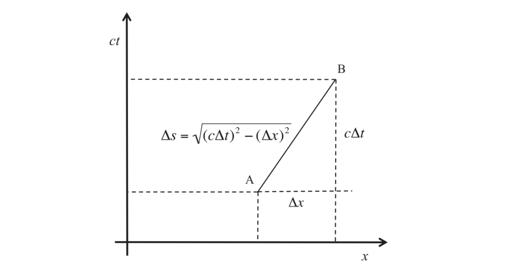
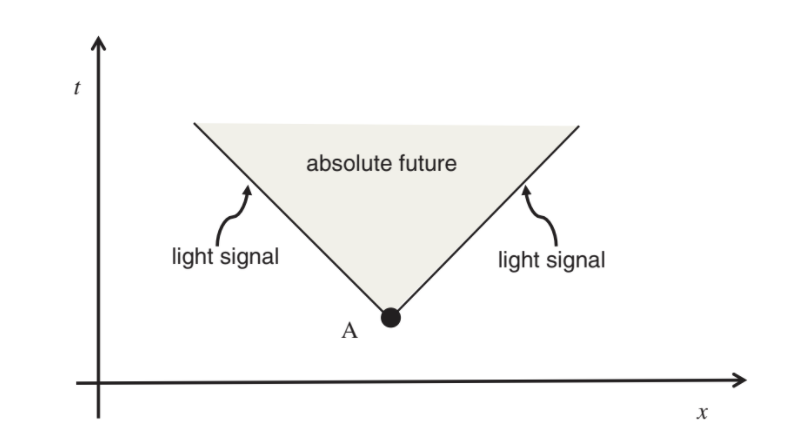

# (PART) The Big Bang and the Observable Universe {-} 

```{r, echo=FALSE}
colorize <- function(x, color) {
  if (knitr::is_latex_output()) {
    sprintf("\\textcolor{%s}{%s}", color, x)
  } else if (knitr::is_html_output()) {
    sprintf("<span style='color: %s;'>%s</span>", color, 
      x)
  } else x
}
```


# Overview 📃{#overview}

Cosmology is the study of the origin, nature and evolution of our universe. 

## The Big Cosmic Questions 🧐

Cosmological practitioners strive to describe cosmic history in quantitative detail, using the language of modern physics and abstract mathematics. 

But if you think about it and think real hard, there are only a few fundamental questions in cosmology:

* Is the universe finite or infinite ?
* Has it existed forever ? If not, when and how did it come into being ?
* Will it ever end ?
* Where do Humans fit into the grand scheme of things ?

Religion and Science both aim to answer these questions. According to Chinese creation myths the universe exists because a giant broke open a black egg, according the christian creation story it was Adam and Eve. 

For a long time it was assumed that we would never know the answers to the "big" questions and thus, cosmologists focused on the part of the universe that was directly observable and left the great mysteries to the philosophers 🤵🏻 and theologians ⛪.

## The Origins of Scientific Cosmology 🌌

Some say the idea that the universe can be rationally understood is at the foundation of all scientific knowledge. 

The history is quite exciting. 

* At one side we had legends like `r colorize("Thales", "#FFFF00")`, `r colorize("Democritus", "#FFFF00")` and `r colorize("Epicurus", "#FFFF00")` who believed that matter (and living beings along with it) were made up of Fundamental particles and that we evolved due to random rearrangements without any set reason. 

* Then we had `r colorize("Pythagoras", "#FFFF00")` who was the first one to call the heavens as `r colorize("cosmos", "#33CCFF")`, which mean `r colorize("order", "#33CCFF")` 🤯!!. He suggested that the Earth, the Sun, and the other celestial bodies are perfect spheres and move in perfect circles around a central fire, which cannot be seen by human eyes. 

* `r colorize("Plato", "#FFFF00")` and `r colorize("Aristotle", "#FFFF00")` proposed more elaborate versions, saying that the earth was at the center, with the other bodies revolving around it about a center. Keep in mind this was a finite universe. 

* `r colorize("Claudius Ptolemy", "#FFFF00")` gave his own model (The Geocentric model) using the concept of nested epicycles and retrogrades to account for the backward and forward motion of planets in the night sky. This model was followed for almost 1500 years 🤯!!!


```{r, echo=FALSE, fig.align='center', fig.cap="Ptolemaic Model"}
knitr::include_graphics("assets/images/Ptolemaic_elements.svg")
```

* Then around 16th century, `r colorize("Nicolaus Copernicus", "#FFFF00")` gave the heliocentric model which kept the Sun at the center and had the Earth and other celestial revolve in orbits. ( This idea was not taken well by the religious folk ) 


```{r, echo=FALSE, fig.align="center", fig.cap = "Copernecian Model"}
knitr::include_graphics("assets/images/Copernican_heliocentrism_diagram-2.jpg")
```

* The next breakthrough happened by the hands of `r colorize("Johannes Kepler", "#FFFF00")` under the mentorship of `r colorize("Tacho Brahe", "#FFFF00")` when he introduced the concept of elliptical orbits. 
* Then ofcourse came `r colorize("Issac Newton", "#FFFF00")` who showed that we could derive the elliptical orbits of planets from his three laws of motion and the law of universal gravitation.

## Present Time ⌚️

Despite it's seemingly long history, Cosmology is a relatively young field. Most of the knowledge that we have comes from the data recorded in the last 100 years. 

* We discovered that our Sun belongs to a huge disk-like conglomeration of about 3 hundered billion stars 🤯!!!, known as the Milky Way galaxy 🌌. 

* Not only is the Sun merely one out of a hundred billion, our galaxy is one out of hundred billion other galaxies which are scattered throughout the observable universe. 

* `r colorize("Edwin Hubble", "#FFFF00")` in 1929 showed that these all these galaxies aren't really suspended. Rather, they are rushing away from each other at extremely high speeds. The Universe is expanding 🤯!!!.

* Now, if we extrapolate this expansion, backwards in time, we come to realize that the universe was once much denser and hotter. This is what's called the `r colorize("Big Bang Theory", "#33CCFF")`. At the time of "creation", all of space was filled with an extremely hot, dense condensed but still expaning "fireball ☄️" (of sorts). As it continued to expand, it eventually cooled leading to the formation of atoms, nuclei, stars, galaxies and then us !

* In 1965 `r colorize("Arno Penzias", "#FFFF00")` and `r colorize("Robert Wilson", "#FFFF00")` discovered a remnant of this primordial fireball ☄️. They found that the entire universe if bathed in a sea of low-intensity micro-waves, known as the 
`r colorize("Cosmic Microwave Background Radation (CMB)", "#33CCFF")`. Thus, becoming a smoking gun 🔫 proof of big bang theory. 

* The big bang theory, now has it's roots in `r colorize("Albert Einstein's ", "#FFFF00")`, `r colorize("General Theory of Relativity", "#33CCFF")`. 

* `r colorize("George Gamow", "#FFFF00")` introduce the idea of the early universe being hot. He argued that the hot primordial fireball was the furnace where all the present day chemical elements were forged. Gamow, along with `r colorize("Raplh Adler", "#FFFF00")` and `r colorize("Robert Herman", "#FFFF00")` successfully calculated the abundance of hydrogen and helium. 

* In the 1980s and 90s, with the rise of astronomical data, the field emerged. Radio and optical astronomy flourished with computerized galaxy surveys and instruments like the `r colorize(" Very Large Array (VLA)", "#33CCFF")` and the satellite `r colorize("Cosmic Background Explorer (COBE)", "#33CCFF")`.

* The `r colorize("Hubble Space Telescope", "#33CCFF")` has captured images of galaxies so far away that it took much of the age of the universe for their light to reach us.

* The turn of the century saw the launch of the `r colorize("Williamson Microwave Anisotropy Probe(WMAP)", "#33CCFF")` satellite. 

We are truly living in the golden age of cosmology and astronomy. It may seem like observations have proven most questions, but the intriguing and in my opinion the most important questions, still remain. We've only just begun our journey from the microcosm to the macrocosm.

# Newton's World 🌎

In the remarkable book `r colorize("Principia", "#33CCFF")`, Newton formulated the general laws of motion and the law of universal gravitation. He then went on to apply these laws to explain the motion of celestial bodies, projectiles and oceanic tides. 

## Newton's Laws of Motion 3️⃣

Newton's First 1️⃣ law states that a body that is at rest will stay at rest, and a body that is moving with a constant velocity will maintain that constant velocity, unless it is acted upon by a force. This Law also goes by the name of `r colorize("The Law of Inertia", "#33CCFF")`. 

Newton's Second 2️⃣law tells us that if a force is applied to a body, the body accelerates - meaning its velocity changes. The law can be stated mathematically as:

$$ \vec{a} = \frac{\vec{F}}{m} $$
where, $\vec{a}$ is the acceleration of the body, $m$ is its mass, and $\vec{F}$ is the applied force. The acceleration is defined as the rate at which the velocity changes.

Newton's Third 3️⃣ Law states that every action has a equal and opposite reaction.

## Newtonian Gravity 🍎

Newton's law of gravity states that any two objects are attracted to one another with a force: 

$$F = \frac{GMm}{r^2}$$

where $M$ and $m$ are the masses of the two objects and $r$ is the distance between them. The force acting on mass $m$ is directed towards the mass $M$ and vice-versa. This also introduced Newton's gravitational constant $G$, 

$$ G = 6.67 \, \times \, 10^{-11} \, Nm^2/kg^2 $$
Newton's law of gravity is an "inverse square law", because the gravitational force is inversely proportional to the square of the distance between the two objects.

The masses are assumed to be "point masses"; i.e., we assume that their sizes can be neglected, so we can imagine that each mass is located at a point.

Furthermore, Newton proved the `r colorize("Shell Theorem", "#33CCFF")`, which states two important facts: 

* A uniform spherical shell of matter attracts an outside object as if all of the shell's mass were concentrated at its center. This applies to any uniform spherically symmetric object, like a solid sphere, since the object can be thought of as consisting of shells. 

* The gravitational force exerted on an object that is inside a uniform spherical shell of matter is zero.

## Acceleration of Free Fall

In everyday terms we often confuse weight and mass. When we get on a scale, we measure our weight — this is the force of gravity which pulls us towards the center of the Earth. For a small object of mass $m$ near the surface of the Earth, the weight is given by

$$ F = \frac{GM_Em}{r^{2}_{E}} $$

where $M_E = 6 \, \times \, 10^{24} \, kg$ is the Earth's mass, and $r_E = 6.4 \, \times \, 10^6 m$ is its radius. 

Now let's consider what happens if we have an object of mass $m$, close to the surface of the Earth, and we let it go. It will fall with acceleration $a = F/m$, which becomes

$$ a = \frac{GM_Em}{r^{2}_{E}} \frac{1}{m} = \frac{GM_E}{r^{2}_{E}} $$
This does not depend on the mass $m$, which means that all bodies close to the surface of the Earth fall with the same acceleration, independent of their mass (as long as we ignore air resistance).

## Circular Motion and Planetary Orbits

```{r, echo=FALSE, fig.align="center", fig.cap = "Uniform Circular Motion"}
knitr::include_graphics("assets/images/Uniform_circular_motion.svg")
```

For uniform circular motion, the magnitude of the acceleration is: 

$$ a = \frac{v^2}{r} $$
where $v$ is the speed of the object undergoing the motion and $r$ is the radius of the circle. The direction of the acceleration is radially inward, towards the center of the circle and is called the `r colorize("centripetal acceleration", "#33CCFF")`.

Newton showed in his Principia that the inverse square law implies that celestial bodies like planets and comets should move in elliptical orbits, in agreement with Kepler. While comets often move in highly eccentric orbits, for planets the two focal points of the ellipse almost coincide, so the orbit is approximately a circle. If the radius of the orbit is $r$, its circumference is $2πr$, and the velocity of the planet is

$$ v = \frac{2πr}{T} $$
where $T$ is the time it takes to complete one revolution.

## Newtonian Cosmology

Newton’s cosmological ideas developed during a correspondence with the Cambridge theologian `r colorize("Richard Bentley", "#33CCFF")`. Bentley was preparing to give public lectures titled “A confutation of atheism” and wrote to Newton asking him how his theory of gravity applied to the universe as a whole. During the winter of 1692–93, Newton sent a series of four letters to Bentley, in which he described a universe that is infinite and static: “The fixed stars, being equally spread out in all points of the heavens, cancel out their mutual pulls by opposite attractions.” 

Newton was acutely aware, there is a problem with this line of reasoning. If a region of the universe has a slight excess of matter, then that region will begin to attract material from its surroundings. Te region will become denser, and it will attract more and more matter. Thus a un- form distribution of stars is unstable due to gravity: it would be destroyed by an arbitrarily small perturbation. Newton’s solution was to invoke a super-natural intervention, stating “...this frame of things could not always subsist without a divine power to conserve it.”.

## Olbers' Paradox

What do you think the Sun would look like if it were at twice its present
distance from the Earth??

* The total brightness of the Sun would be four times smaller because the brightness of an object decreases as the inverse square of the distance to the object. 

* The area of the Sun’s disc on the sky would also be four times smaller. This means that the brightness per unit area (called the surface brightness) remains the same. 

* So what? Well, in an infinite universe that is uniformly sprinkled with stars, every line of sight should eventually hit a star, and each star should have roughly the same surface brightness as the Sun. Thus implies that the whole sky should be glowing with the same intensity as the Sun’s surface.

This is known as the `r colorize("Olbers' Paradox", "#33CCFF")` or the `r colorize("Dark Night Sky Paradox", "#33CCFF")`.

While Newton showed that his universal law of gravity could explain a vast scope of natural phenomena, he was at a loss to explain **how it could be that the force of gravity acts instantaneously, between every pair of particles, across the vastness of space.**

> At the end of his Principia, Newton conceded: “Thus far I have explained the phenomena of the heavens and our sea by the force of gravity, but I have not yet assigned a cause to gravity.... I have not as yet been able to deduce from phenomena
the reason for these properties of gravity and I do not feign hypotheses,” but he then
went on to declare “And it is enough that gravity really exists and acts according
to the laws that we have set forth and is sufcient to explain all the motions of the
heavenly bodies and of our sea.”

Despite of **Olbers' Paradox** and the problems of **gravitational instability**, Newtonian cosmology held sway for about 200 hundred years - until ofc Einstein's general theory of relativity absolutely revolutionized 🤯 🤯 our understanding of gravity once again. 

# Special Relativity 

## The Principle of Relativity

Although nowadays, the word "relativity" is synonymous with Albert Einstein, `r colorize("Galileo Galilei", "#33CCFF")` was actually the first scientist to formulate what we now call "**the principle of relativity**". 

In his famous `r colorize("Dialogue (1632)", "#33CCFF")`, Galileo suggested a mind experiment, that they should shut themselves up in the cabin of a ship, below the decks, so that they could see what was going on outside. He argued that they would not be able to tell whether the ship was stationary or moving, as long as the motion was uniform and in the same direction, without any turns. The choice of ship 🚢 was arbitrary, try imagining the same but in a train or a airplane. When the motion is smooth enough, and if you have closed your eyes, you would've noticed that you cannot tell whether you're moving or not. 

> Even rn, we are moving  with the Earth around the Sun at a speed of 30 km/s, and with the entire Solar System around the galactic center at about 230 km/s. Even these velocities have no effect whatsoever on our daily tasks.

Towards the end of the 19th century, a new problem emerged. The speed of light was measured to be around $300,000 \, km/s$. The problem was **speed with respect to what ??** 🧐. 

When we say that the speed of sound is around $300 \, m/s$, it is understood that the sound propagates through the air to the observer from its source. Thus an observer, who is at rest with respect to the air, will measure this value for the speed of sound. 

Scientists assumed that for light this would be pretty much similar. Back then people believed that light propagated through something referred to as `r colorize("Ether", "#33CCFF")`. If we are at rest with respect to the ether, we should find that light propagates in all directions at the same speed of 300,000 km/s. But what if we are moving through the ether at a speed of, say, 100,000 km/s? Then a light pulse propagating in the same direction will only move at 200,000 km/s relative to us, while a pulse propagating in the opposite direction will speed away from us at 400,000 km/s.The speed of light in the directions orthogonal to our motion would remain unchanged at 300,000 km/s. Thus, in a space filled with ether, inertial observers who move at different speeds will no longer be equivalent. They will observe that the speed of light is direction-dependent, and they can use this to deduce their own speed with respect to the ether.

An ingenious apparatus for measuring the difference between the speeds of light in two orthogonal directions was designed by `r colorize("Albert Michelson ", "#33CCFF")` and `r colorize("Edward Morley", "#33CCFF")`. They knew that if our speed through the ether was as high as 100,000 km/s, then the direction-dependence of the speed of light would have been noticed in earlier experiments. Thus, Michelson and Morley expected to measure a much smaller number—which required a much higher accuracy.

The result was startling 🤯🤯. They detected no variation in the speed of light in different directions. To ensure that the Earth's motion around the Sun at the time of the experiment was not accidentally compensated by the motion of the Solar System, they repeated the same experiment six months later. But again, no effect was found. 

The most logical and rather obvious conclusion suggested that the speed of light does not depend on the speed of the observer who measures it. This conflicted with **Newtonian Physics** and **Common Sense**. Thus, as most physicists just ignored the results. 

Well, the paradox was solved in 1905 by a 26 year old patent clerk from Bern. His name was Albert Einstein and He threw Newtonian Physics and Ether out of the window. 

## The Speed of Light and Electromagnetism

The two famous predictions from Maxwell's theory of electromagnetism are:-

1. Oscillating electric and magnetic fields propagate through space as electromagnetic waves

2. The speed of an electromagnetic wave is 300,000 km/s.

Maxwell ofc realized this speed as the speed of light. He thus concluded that light must be a electromagnetic wave.

The theory of light as an electromagnetic wave is a pillar of classical physics. However, in some circumstances, such as when light interacts with atoms, it is necessary to adopt the view of quantum physics. In this modern picture, we see a light wave is thought to be composed of huge number of photons that travel together. 

## Einstein's Postulates

In the awesome 1905 paper `r colorize("On the Electrodynamics of Moving Bodies", "#33CCFF")`, Einstein gave the following assumptions:

1. The laws of physics are the same for all inertial observers. This Galileo's **principle of relativity**.

2. The speed of light measured by all inertial observers is the same.

The second postulate implies that there is no ether. 

Using just these 2 assumptions, Einstein led us to the:

* `r colorize("Relativity of Simultaneity", "#33CCFF")`.

* `r colorize("Time Dilation", "#33CCFF")`.

* `r colorize("Length Contraction", "#33CCFF")`.

* `r colorize("Mass-Energy Equivalence", "#33CCFF")`.

## Simultaneity

Now, let's perform the famous Einstein Thought Experiment.

Suppose Jane is standing in the middle of a moving train car, holding the switch of an overhead light bulb, which is initially turned of. Now she turns it on, and light propagates towards the front and back walls of the car. Since she is in the middle, light reaches the two walls at the same time. At least from her point of view. Now suppose Ben is observing this experiment standing on the platform. He sees Jane turn on the bulb, and light propagates in both directions at the same speed, which is of course the speed of light. But the back wall of the car is moving toward the approaching beam of light, while the front wall is moving away from the beam, so Ben will see light reach the back wall before it reaches the front wall.

----
**CONCLUSION: The simultaneity of events has no absolute meaning; it depends on the state of motion of the observer.**
----

## Time Dilation

```{r, echo=FALSE, fig.align="center", fig.cap = "Time Dilation"}

```

Now, let's add on to the thought experiment by assuming that Jane (in the train with a speed $v$) is equipped with a light source, located at the floor of the her train car, and a mirror at a distance $L$ directly above the source. By simply pushing a button, a light pulse is sent from the source to the mirror and back again. This round trip would take time $t_0 = 2L/c$ (**as measured by Jane**).

Now from Ben's perspective, the light pulse travels along a diagonal path $D$ which is longer than $L$ and the time taken will be $t = 2D/c$ for the pulse to complete the trip. Thus, the time interval between the same events is different when measured by different observers. 

In particular, they are related by the formula:

$$ t = \gamma t_0$$

The relativistic factor $\gamma$ (also known as the `r colorize("Lorentz factor", "#33CCFF")` is defined as:

$$ \gamma = \frac{1}{\sqrt{1 - v^2/c^2}}$$

This factor equals 1 when the relative velocity between two frames is zero.

```{r, echo=FALSE, fig.align="center", fig.cap = "Lorentz factor as a function of velocity"}

```

Consider this plot, as Jane turns on the engines and reverses the velocity of her train/ship, she is no longer an inertial observer, and thus the laws of special relativity do not apply in her reference frame.

## Length Contraction

Now that we know that time and simultaneity are relative, it's pretty easy to extend this logic to space as well. 

If $L_0$ is the length of an object at rest, and if the object then moves past an observer at speed $v$, the observer will measure the length of the object to be 

$$ L = L_0 / \gamma$$

## Mass-Energy Equivalence 

After two years of publishing his breakthrough paper, he reached another famous equation $E = mc^2$.  

We can also extend this into Einstein's relativistic energy equation as:

$$ E = mc^2 = \gamma m_0 c^2$$

Also, note that the energy for an object at rest does not vanish - it is the rest mass $m_0$ (times $c^2$). 

Another important feature of the relativistic energy is that it tends to infinity when the velocity of an object approaches the speed of light. It takes increasingly large amounts of energy to bring the speed of the object closer and closer to the speed of light, but the limit $v = c$ can never be reached. Thus, the speed of light is the absolute speed limit in the Universe

## Space ➕ Time  ＝ SpaceTime

It's pretty easy to deduce that time is the 4th dimension. For instance, when we want to indicate a location in space we also add Time in it. For example:

> "Let's meet at Starbucks"

But when?? The complete statement should be: 

> "Let's meet at Starbucks tomorrow at 6 PM"

When we combine such notions, we speak of **spacetime**. This is not acceptable in Newtonian Physics as space and time are completely independent. But as per Einstein's theory it's completely natural, infact space and time are routinely depicted together in spacetime diagrams. 

Let's explore this by drawing an analogy with Euclidean geometry on a plane. Suppose we have two points on a plane that are connected by a straight line segment. We can characterize this segment by its projection on two orthogonal axes, $x$ and $y$. The squared length of the segment remains equal irrespective of the axes. (Because of Pythagoras Theorem). 

Now compare this situation with Einstein's theory. Given two events, their separations in space and time will differ for different observers. But this is only because the events are being projected on different space and time axes. Einstein's former mathematics professor Minowski realized that all observers will agree on a specific quantity called the `r colorize("spacetime interval", "#33CCFF")`

```{r, echo=FALSE, fig.align="center"}

```

Consider two events A and B as per the fig. The square of the spacetime interval can then be expressed as:

$$ (\Delta s)^2  = (c \Delta t)^2 - (\Delta x)^2$$

Since all inertial observers will agree on the value of the spacetime interval, we say that the spacetime interval is `r colorize("invariant", "#33CCFF")`

## Causality in Spacetime

With space and time intervals varying from one observer to the next, it's often easy to feel that physical reality is slipping away. Especially when you start thinking about the relation between cause and effect. 

Let's assume that someone jumps at some time and place (Event A). Light propagates outwards along $45^o$ lines. And as matter moves slower than light, the matter is confined to lie between the shaded region.

```{r, echo=FALSE, fig.align="center"}

```

Now, we can conclude that all observers will agree that all events in the shaded region are in the future of A. (Thus, it's called the `r colorize("absolute future", "#33CCFF")`). 

```{r, echo=FALSE, fig.align="center"}
knitr::include_graphics("assets/images/spacetime-2.png")
```

Now, let's think about all the events that can influence A. These are the events lying in the region `r colorize("absolute past", "#33CCFF")`. Also, the arbitrary event B can neither influence, nor be influenced by event A.

For events in the absolute past of A, all observers will agree that they occurred earlier than A. However, for events like B that are not in the absolute future or past of A, observers will disagree: some of them will find that B is prior to A; others will find that it is later; and there will be some who will find that both events occurred at the same time.

Thus, we can conclude that the time ordering of events can be reversed by going to another frame of reference only if the events are not causally related. Now, try imagining the same diagrams but in 3 dimensions. Then these regions would be converted into conical surfaces called `r colorize("light cones", "#33CCFF")`. 

```{r, echo=FALSE, fig.align="center"}
knitr::include_graphics("assets/images/spacetime-3.png")
```

